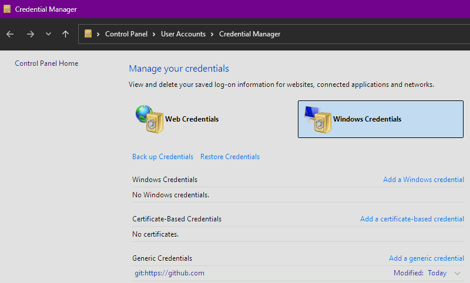
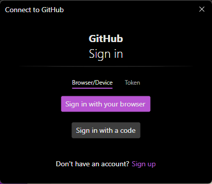

# Introduction
Dans ce TP on va travailler les notions de dépôt distant, de branches, et les opérations qui vont avec

## Commandes utiles
* `git clone` : clôner un dépôt distant ; configure automatiquement l'upstream.
* `git remote` : donne la liste des remote.
  * `git remote add <remote> <url>` : crée une référence vers un dépôt distant
* `git fetch` : va télécharger le contenu du dépôt distant sans essayer d'écraser ce que vous êtes en train de faire.
* `git merge <branch>` : essaye de fusionner la branche désignée avec la branche courante.
* `git pull` : va télécharger le contenu du dépôt distant, puis essayer de fusionner avec la branche locale (`git fetch` + `git merge <remote>/<branch>`)
* `git log <remote>/<branch>` : interroge l'historique distant après un `fetch`. Pour savoir ce que vous allez récupérer *avant* de fusionner.
* `git branch` : donne la liste des branches *locales* connues.
  * `git branch -M <nouveau_nom>` : renomme la branche courante ; utile si le dépôt distant utilise une branche avec un nom différent.
  * `git branch <branch>` : crée une nouvelle branche.
  * `git branch -d <branch>` : efface une branche.
* `git switch <branch>` : bascule sur une branche.
* `git stash` : pour mettre ses modifications en cours de côté avant d'utiliser `git switch`.
  * `git stash pop` : pour ré-appliquer les modifications qu'on a mises de côté précédemment.
* `git push` : envoie l'historique de la branche en cours vers le dépôt distant
  * `git push --set-upstream <remote> <branch>` : lorsqu'une branche locale n'existe pas encore sur le dépôt distant, l'option `--set-upstream` (ou `-u`) est nécessaire pour indiquer le lien entre local et distant. C'est la même opération que `git branch --set-upstream-to` plus haut. Sauf qu'ici on combine avec un push.

# Clônage d'un dépôt distant
Normalement vous avez tous créé votre compte sur GitHub. Nous allons donc clôner ce dépôt localement, pour ensuite pouvoir travailler.  

## Dépôt public : pas d'identifiants nécessaires
La façon la plus simple est de faire un clone de son dépôt distant, ce qui va configurer le remote et le nom de branche principale.  
Placez-vous dans un répertoire où vous avez les droits d'écriture et lancez la commande de clônage :  
``` 
git clone https://github.com/<mon_compte>/<mon_depot> <repertoire_local>
# Exemple pour le repo de vos cours avec moi :
git clone https://github.com/PanPraescribens/git_101.git depot_git_101
```
## Dépôt privé : identifiants
Il existe un grand nombre de manière de se connecter à un dépôt distant.  Cela peut aller du simple nom d'utilisateur et mot de passe sauvegardé localement, à l'installation d'un certificat SSL, l'utilisation d'un jeton unique, etc.  
Dans le cas de Github nous allons utiliser une méthode simple : connexion via navigateur, et stockage des identifiants dans le gestionnaires d'identifiants Windows.  
### Créer un dépôt privé sur Github
Dans Github, sur votre compte, les dépôt sont publics par défaut. Pour passer en privé, vous pouvez aller dans les réglages du dépôt, puis descendre dans la zone de danger et cliquer sur "Changer la visibilité". Une fois l'opération effectuée, le dépôt n'est plus accessible sans identifiants, les mêmes que vous utilisez pour vous connecter à votre compte Github dans le navigateur.  
  
Pour les besoins de l'exercice, si vous avez des identifiants présents, effacez-les !  

### Clônage du dépôt privé
Ensuite allez en ligne de commande et clônez votre dépôt privé comme précédemment pour votre public.  
Vous devriez être confrontés à un message de connexion qui vous propose plusieurs options.  
  
Si vous utilisez le navigateur, et que vous vous êtes déjà connecté sur Github, une session existe déjà et Windows va automatiquement créer ce qu'il faut, stocker les identifiants dans le gestionnaire Windows, et vous n'aurez rien d'autre à faire. La connexion est établie et restera présente tant que vous vous connectez sur cette machine.  

## Dépôt local
Si pour une raison ou une autre vous n'avez pas de compte github, nous pouvons tout de même simuler tout le TP avec un dépôt "distant" que nous allons créer dans un autre répertoire !  

### Création du dépôt "distant" local
```
mkdir ~/mon_depot_distant
cd ~/mon_depot_distant
git init --bare
```
Ceci va créer un dépôt **nu**. Si vous regardez son contenu, vous pouvez voir que vous êtes à l'intérieur d'un répertoire .git, en fait. Il n'y a ***pas d'espace de travail***, dans ce dépôt.  
On va donc juste le créer et y faire référence, mais jamais y travailler directement.

### Cloner le dépôt "distant" local
Placez dans un autre répertoire, qui ne soit pas un dépôt, et où vous avez les droits en écriture, et nous allons clôner notre dépôt fraichement créé.  
```
git clone ~/mon_depot_distant mon_repertoire_cible
```

C'est tout. Vous avez ainsi clôné votre "dépôt distant" et pouvez effectuer tous les exercices de la même manière que si vous aviez un dépôt sur Github.  

# Connexion "manuelle" à un dépôt distant
Si la commande `git clone` est bien pratique, il arrive qu'on ait un dépôt local existant, avec du code, un historique, et qu'on veuille l'envoyer sur un dépôt distant vierge.  
Dans ce cas là on peut difficilement utiliser `git clone` et il faut comprendre les opérations à faire (généralement une seule fois).  

Notez que le comportement de certaines de ces commandes est un peu différent si le dépôt distant est vierge ou pas.  

## Existence d'un dépôt distant vierge
Pour cet exercice, nous avons créé un dépôt vierge, que ce soit sur github ou dans un répertoire local comme décrit dans l'étape précédente.  
La situation peut tout à fait arriver : vous avez créé du code sur votre machine, sous le coup de l'inpiration, et vous n'aviez pas accès à votre github ou autre dépôt distant. Mais grâce à github vous pouvez travailler localement et quand vous en avez la possibilité, créer un depôt distant pour y déposer votre précieux travail. C'est ce qu'on va faire ici.

## Travail local
Nous créons un dépôt local dans lequel nous allons simuler du développement, que nous allons ensuite envoyer à notre dépôt distant.  

```
mkdir ~/depot_local
cd ~/depot_local
git init
echo "Hello world!" > hello.txt
git add --all
git commit -m "Ajoute le fichier de bienvenue"
```

À ce stade nous sommes dans notre répertoire de travail, et nous voulons connecter notre dépôt local à un dépôt distant qui va recevoir le fruit de notre labeur.  

## Création de la référence distante
Traditionnellement, on utilise une référence appelée "origin" pour parler de notre dépôt distant. C'est généralement cette référence qui est utilisée dans les exemples de commande, mais rien ne vous interdit de remplacer ce nom par ce que vous préférez.  

```
git remote add <remote> https://github.com/<mon_compte>/<mon_depot>

# Exemple avec le dépôt "distant" de plus haut :
git remote add prime ~/mon_depot_distant
```

> Avec la création de notre référence distante, si nous avions un dépôt distant avec du contenu, nous pourrions immédiatement utiliser la commande `git fetch` pour voir le contenu distant, par exemple le nom des branches.  
> Ça peut être utile quand le nom de la branche distante est par exemple `main` (défaut GitHub) et que notre locale est `master` (défaut git).
> Nous pouvons d'ailleur renommer la branche actuelle avec `git branch -M <nouveau_nom>`

## Création du lien *upstream*
Là où *remote* fait référence à un dépôt distant entier, le terme d'*upstream* fait référence à la branche spécifique sur un dépôt distant, associée à la branche locale.  

À ce stade, nous avons créé des commits en local et nous voulons les envoyer en amont ("upstream") sur une branche distante.  
Typiquement, lorsqu'on a un dépôt distant vierge, la seule façon d'associer un *upstream* est de le faire au moment où on veut envoyer des données, avec `git push`.  

> La commande `git branch --set-upstream-to=<remote>/<branch>` est censée créer un upstream, mais ne marche pas si la branche distante n'existe pas encore. Ce qui est le cas sur un dépôt vierge.  

On va donc **pousser** nos commits et associer un upstream dans la même commande :  
```
git push --set-upstream <remote> <branch>
#<remote> le nom de votre remote créé plus tôt
#<branch> le nom de la branche distante, normalement le même que la branche locale

#Exemple avec le dépôt "distant" créé plus haut et la syntaxe courte: 
git push -u prime master
```

## Travail avec dépôt distant
À ce stade, notre branche locale principale est liée à une branche sur le dépôt distant et on peut donc utiliser les opéartions sans faire référence à chaque fois au dépôt distant.  
`git pull` va aller chercher automatiquement les nouveau commits sur la branche de même nom, sur le dépôt distant.  
`git push` enverra les nouveautés.

Faisons un essai :  
```
echo "Hello remote !" >> hello.txt
git commit -a -m "Dit bonjour au dépôt distant"
git push
```
> Ici j'ai utilisé l'option `-a` qui va automatiquement faire un `git add` de tous les fichiers **déjà connus** et modifiés ou effacés. Pour de nouveaux fichiers, il faut toujours utiliser `git add` explicitement.

Normalement vous devriez voir que votre travail a bien été envoyé à distance.  

# Travail nomade
À ce stade, nous avons un dépôt distant. Nous pouvons donc travailler sur diverses machines, et passer de l'une à l'autre sans souci, si nous sommes bien organisés.  

Pour tester cette partie, nous devons avoir un dépôt distant qui contient des commits.

Nous allons créer plusieurs dépôts locaux pour simuler le passage d'une machine à une autre.  

## Dépôts nomades
Nous allons clôner notre dépôt distant dans deux répertoires locaux, et passer de l'un à l'autre pour simuler le fait de trvailler sur deux machines physiques différentes.  

```
mkdir mon_pc_bureau
mkdir mon_laptop

#ici j'utilise le dépôt "distant" local, mais vous pouvez utiliser votre dépôt github
git clone ~/mon_depot_distant mon_pc_bureau
git clone ~/mon_depot_distant mon_laptop
```

## Clônage pour travailler directement
Dans cette première étape, nous sommes dans la situation où nous venons de clôner le dépôt distant, donc nous sommes à jour.  

Allons dans `mon_pc_bureau`.  
Lorsque nous avons fait le clônage, git a téléchargé la branche principale et tous ses commits donc on a rien à faire, on peut immédiatement se mettre à travailler.  

```
echo "Travail au bureau" > main.txt
git add main.txt
git commit -m "Ajoute le fichier main"
git push 
```

Le clônage a également créé un *remote* appelé `origin` par défaut, et a créé l'*upstream* pour la branche principale. On peut donc utiliser la commande `git push` sans argument.  

## Avant de travailler : des nouveautés ?
Basculons maintenant sur notre deuxième dépôt, `mon_laptop`.  

Ici nous sommes dans une situation un peu différente, puisque du travail a été fait entre le moment où nous avons créé ce dépôt, et maintenant. Nous sommes "en retard".  

Si vous faites `git log` vous devriez voir que vous n'avez pas le commit "Ajoute le fichier main", par contre git ne vous dit rien de plus.  
**C'est à vous de vérifier que votre dépôt est à jour.**  
Comment faire ? 

Une façon simple est de faire `git fetch` régulièrement.  
Cette opération va aller aux nouvelles, télécharger toutes les nouveautés distantes, mais ne va pas toucher votre travail local.  
Si vous voyez que l'opération a téléchargé quelque chose, vous pouvez faire un `git status` qui pourra alors vous indiquer qu'effectivement, votre branche en cours est en retard par rapport à sa copie sur le dépôt distant :  
```
On branch master
Your branch is behind 'origin/master' by 1 commit, and can be fast-forwarded.
  (use "git pull" to update your local branch)
```
La mention au "fast-forward" est un bon signe qui pour l'instant veut dire qu'on peut fusionner la branche distante sans se poser de question, ça marchera.  

Vous pouvez également voir les nouveautés via `git log origin/master` qui va utiliser la copie locale récupérée par `fetch` pour vous montrer les nouveautés:  

```
c4a0d14 (origin/master) Ajoute le fichier main
54241bd (HEAD -> master) Ajoute le fichier de bienvenue
```

Vous pouvez utiliser les options de `git log` pour avoir plus de détails. Par exemple `--stat` va vous informer des éventuels fichiers modifiés ou créés.  

## Fusion des nouveautés
Lorsqu'on a fait le `fetch`, git a créé une copie locale de la branche distante. Vous pouvez la voir en tapant la commande `git branch --all` qui va vous montrer les copies distantes.  

Par exemple : 
```
* master
  remotes/origin/master
```

Nous voulons incorporer les nouveaux commits présents sur le dépôt distant dans notre branche locale. On appelle ça une ***fusion***.  

```
git merge origin/master
```
À ce stade notre dépôt local est à jour.  
Et si vous regardez votre espace de travail, les fichiers ont été modifiés pour refléter le dernier commit que vous venez de fusionner.  

> Pour l'exercice je vous ai fait faire `git fetch` puis `git merge <remote>/<branch>`.  
> La commande `git pull` fait exactement la même chose et c'est celle que nous allons utiliser au jour le jour.

## Continuer le travail
Maintenant notre dépôt "laptop" est à jour, nous pouvons continuer notre travail.  

```
echo "Travail depuis notre laptop" >> main.txt
git commit -a -m "Modifie le fichier main"
git push 
```

On a simplement rajouté une ligne à notre fichier, on fait un commit avec l'option `-a` pour ajouter la modification au vol et faire un commit, qu'on pousse ensuite sur le dépôt distant.  

## Retour au bureau
Dernière étape, on rebascule sur notre dépôt du bureau et on met à jour :  
```
git pull
```
Comme dit précédemment, `git pull` va faire un fetch pour télécharger les nouveautés, puis va immédiatement essayer de les fusionner.  

## Ou ailleurs
Et bien sûr, on pourrait continuer notre travail sur une troisième machine avec un simple `git clone` qui nous fournirait une copie à jour et utilisable immédiatement.  

# Branches
Dans les paragraphes précédents, on a utilisé plusieurs copies d'un même dépôt dans différents répertoires, pour les besoins de notre TP.  
Cela devrait vous faire vous poser la question : qu'est-ce qui nous empêche d'utiliser une copie de notre dépôt pour faire des essais ?  
En fait, rien du tout, du moment que vous travaillez localement !

Dans notre exemple du travail nomade, on aurait pu utiliser le dépôt `mon_pc_bureau` pour faire une version du travail, et faire des commits.  
En parallèle on aurait tout à fait pu faire des commits différents sur `mon_laptop`. Si on fait un petit graphe on aurait une situation comme celle là :  
```
mon_depot_distant/master : A <- B 
mon_pc_bureau/master     : A <- B <- C
mon_laptop/master        : A <- B <- D
```

Le problème avec tout cela, c'est que sémantiquement ça ne marche pas.  
La branche `master` est censée représenter *une* réalité, pas trois.  
En créant le commit C sur `mon_pc_bureau`, on fait avancer la branche `master`, ce qui est acceptable, mais quand on crée le commit D sur le dépôt `mon_laptop`, on a une divergence. Ça marche localement, mais par rapport à `mon_pc_bureau` on a un ***conflit***.  

Quand on travaille seul, il est assez rare de se retrouver dans une telle situation, par contre quand on est plusieurs sur un même projet, c'est très courant. Et il faut donc adapter ses méthodes de travail.  

Ces méthodes, on peut commencer à les utiliser même en solo, pour se familiariser aux commandes et aux concepts, sans les difficultés qui vont inévitablement apparaitre à plusieurs.  

## Nouveau développement, nouvelle branche
La première habitude à prendre c'est de comprendre que la branche principale est une zone intouchable, en quelque sorte.  
On ne veut jamais *directement* la modifier, mais seulement l'utiliser pour contenir du code parfait.   
Tout nouveau développement se fait donc dans une branche, qui pourra être ensuite intégrée dans la branche principale *après validation*.  
L'idée c'est qu'*à tout moment*, on peut prendre une copie de la branche principale, et elle contient du code compilable, stable, qui fonctionne.  
Le code contenu dans une branche n'a pas cette contrainte. En fait, on peut même avoir plusieurs niveaux de branches, chacun avec des contraintes plus ou moins fortes de stabilité, de propreté du code, de validation, etc.  

Mettons-nous dans un des dépôts que nous avons créés, mis à jour, dans lequel nous allons créer de nouveaux commits.  

```
cd ~/mon_pc_bureau
git pull
git branch dev
git switch dev
```

Ici on vient de créer la branche appelée `dev` puis on bascule dedans.  
La branche créée est une copie conforme de la branche principale, à ce stade.  
```
mon_depot_distant/master : A <- B 
mon_pc_bureau/master     : A <- B
mon_pc_bureau/dev        : A <- B
```
Créons un commit :
```
echo "Le travail de developpement en cours va dans la branche dev" >> main.txt
git commit -a -m "dev: rajoute une ligne"
```
À ce stade on peut créer autant de commits qu'on veut.  

## Basculer de branche
Si on utilise la commande `git switch master` juste après notre commit, on bascule instantanément sur la branche principale, et si on examine le contenu du fichier `main.txt` on peut voir que notre texte nouvellement ajouté n'existe pas.
On peut revenir sur notre branche avec `git switch dev` et à nouveau si on examine le contenu de `main.txt`, le fichier est bien modifié.  

### Basculer avec des fichiers modifiés
Maintenant modifions notre fichier `main.txt` dans notre branche de dev, et essayons de basculer sur master à nouveau :  
```
echo "Travail en cours" >> main.txt
git switch master
```
Normalement, git va vous opposer une fin de non recevoir :  
```
error: Your local changes to the following files would be overwritten by checkout:
        main.txt
Please commit your changes or stash them before you switch branches.
Aborting
```

En effet, le fichier main.txt, modifié, n'existe pas dans git. Il nous prévient donc aimablement que pour basculer, il a besoin de prendre la version `master` de `main.txt`, mais que votre version en cours serait irrémédiablement perdue !  
Il vous propose deux solutions : 
* faire un commit de vos changements
* mettre vos changements dans une réserve (*stash* en anglais)

Vous connaissez déjà la première solution. Mais avant d'essayer la deuxième, voyons une autre subtilité de la bascule entre branche.

Nous sommes toujours dans la branche, donc effaçons nos changements sur `main.txt` avec `git restore main.txt` qui va par défaut remettre le fichier dans son état au dernier commit sur la branche en cours.  

### Basculer avec des fichiers non-suivis
Maintenant créons un nouveau fichier sur notre branche :  
```
echo "Un nouveau fichier créé pendant notre développement" > dev.txt
git switch master
```
Vous pouvez voir que le fichier existe sur master après la bascule.
```
echo "Modifié dans master" >> dev.txt
git switch dev
```
Et si nous modifions ce fichier, vous pouvez voir que nous pouvons tout à fait basculer, et que sa modification est bien conservée.  

En effet, `dev.txt` n'est pas connu de git, et donc il n'y touche pas. Du moment qu'il peut exister sur les branches où vous basculer, git va simplement tout modifier *autour de lui*, sans y toucher.  
> Si un fichier non-suivi est créé dans un répertoire qui n'existe pas dans l'autre branche, vous aurez un problème.  

Git bascule de branche en changeant ce qu'il connait. Il peut créer ou effacer des fichiers qui existe ou pas dans la branche active.  
Mais il ignore les fichiers non-suivis (ou ignorés) et les laisse en l'état si possible.  

### Utilisation de la réserve pour basculer proprement
Ajoutons le fichier `dev.txt` dans un commit. Nous pourrons le voir apparaitre et disparaitre quand nous basculons de branche.  
```
git add dev.txt
git commit -m "Crée le fichier dev.txt"
```
Puis remodifions notre fichier `main.txt` pour montrer l'utilisation de la réserve : 
```
echo "Travail en cours" >> main.txt
git switch master
```
Vous avez toujours l'erreur, mais cette fois-ci avant de basculer on va mettre nos modifications de côté :  
```
git stash 

 > Saved working directory and index state WIP on dev: 861b384 Crée le fichier dev
```
Le message vous indique que toutes les modifications en cours ont été mises de côté dans une réserve nommée `WIP` par défaut.  
Vous pouvez immédiatement constater que les modifications ont bien disparues.  
Et vous êtes également capable de basculer de branche, puisque votre branche `dev` est désormais "propre" après l'utilisation de `stash`.  

Vous pouvez (depuis n'importe quelle branche) voir la liste des réserves existantes :
```
git stash list

> stash@{0}: WIP on dev: 861b384 Crée le fichier dev
```

Revenez sur la branch `dev` et vous pouvez reprendre votre travail où vous en étiez :  
```
git switch dev
git stash pop

> On branch dev
Changes not staged for commit:
  (use "git add <file>..." to update what will be committed)
  (use "git restore <file>..." to discard changes in working directory)
        modified:   main.txt

no changes added to commit (use "git add" and/or "git commit -a")
Dropped refs/stash@{0} (bc2b6ba9749db18421fa19cc3a75a0181eff0d26)
```
La sous commande `pop`, exécutée sur la branche d'origine de la réserve, va effacer la réserve pour la ré-appliquer sur la branche.  

## Pousser votre branche sur le dépôt distant
Tout comme la branche principale, on veut conserver son travail sur une branche fille, et donc on va utiliser le même principe que précédemment et pousser nos modifications sur le dépôt distant.  
Normalement, une branche créée localement n'a pas d'upstream par défaut, donc vous allez l'initialiser au premier `push`.
```
git commit -a -m "Fini le dev"
git push -u origin dev
```
La commande push devrait vous renvoyer les détails de ce qu'elle envoie et au final, vous pourrez constate avec `git log --oneline` que tout est à jour entre local et distant :  
```
86c56a3 (HEAD -> dev, origin/dev) Fini le dev
861b384 Crée le fichier dev
274a3e0 Ajoute une nouvelle ligne
fda6f8e (origin/master, master) Modifie main
222e06b Crée le fichier main
```

## Requête de fusion
Ici, dans le processus habituel dans un environnement professionel, on passe à l'étape appelée *Pull Request*, ou *Merge Request*, selon les environnements.  
Dans les deux cas on parle de la même chose : demander aux autorités gérant la branche principale si elles veulent bien accepter votre branche et la fusionner avec la principale.  
Les logiciels de CI/CD comme GitLab ou pour vous GitHub proposent des interfaces modernes pour gérer cette partie, qui est hors du cadre de git à proprement parler.  

### Méthode Github
Si vous êtes sur Github, vous allez pouvoir vous rendre dans votre dépôt sur le site web et créer une requête de fusion. Normalement Github va automatiquement détecter l'existance d'une nouvelle branche et vos commits vont automatiquement lancer un dialogue de création de PR/MR à votre prochaine connexion.  

Validez simplement la requête, ce qui aura pour effet de fusionner les commits de la branche sur la branche principale. 

Une fois l'opération validée, `origin/dev` est fusionnée avec `origin/master`, et vous n'avez plus qu'à mettre à jour votre branche `master` locale et effacer votre branche `dev` qui n'est plus nécessaire.  

```
git switch master
git pull
git branch -d dev
```

### Méthode Git
Git ne propose pas de système pour gérer les PR/MR de la même manière. Et on ne peut pas faire de fusion de branche directement dans un dépôt nu, donc on va faire la méthode git :  
* On fusionne la branche sur notre branche master, localement.
* On envoie pousse les changements vers le dépôt distant.
* On peut effacer notre branche devenu inutile.

```
git switch master
git merge dev
> 
  Updating fda6f8e..86c56a3
  Fast-forward
  dev.txt  | 1 +
  main.txt | 2 ++
  2 files changed, 3 insertions(+)
  create mode 100644 dev.txt
```
Ici on a la mention "fast forward" qui nous indique que l'opération est executée immédiatement car dev est une fille directe de master, sans aucun conflit possible. C'est une situation idéale.  

On envoie la fusion au dépôt distant : 
```
git push
>
  Total 0 (delta 0), reused 0 (delta 0), pack-reused 0 (from 0)
  To /home/philippe/mon_depot_distant/
    fda6f8e..86c56a3  master -> master
```

Nous sommes donc maintenant au même niveau local et distant.  
On peut faire le ménage et effacer la branche.  
```
git branch -d dev
> 
  Deleted branch dev (was 86c56a3).
```
Notez qu'ici, on a pas effacé la branche à distance, elle existe toujours.  
Dans le cas de Github, c'est une option à cocher dans la PR/MR.  
Dans le cas de git pur, on peut faire 
```
git branch --remote -d origin/dev
>
  Deleted remote-tracking branch origin/dev (was 86c56a3).
```

Dans les deux cas, on peut tout à fait garder la branche et continuer le développement, si on est tout seul à travailler dessus.

## Fast forward
Dans les deux cas, vous avez une situation idéale puisque la branche `dev` est une descendante directe de la branche `master`, et aucun commit n'a été poussé sur `master` pendant que vous travailliez sur `dev`.   

Concrètement, git n'a absolument rien à créer. Il déplace juste des pointeurs.  

Si on présente les branches dans leur entièreté avant fusion, on peut mieux voir :  
```
A <- B <- master
A <- B <- C <- D <- E <- dev
```
> Fondamentalement, tout ce que git retient d'une branche, c'est où se trouve son dernier commit.  
> La chronologie de la branche est reconstruite au moment où on interroge git, en remontant de parent en parent.
> `master` c'est juste une pointeur sur `B`, qui lui-même pointe sur `A`.  
> Ainsi la branche `master` c'est `A <- B` 

Lorsqu'on fusionne `dev` sur `master`, git va remonter les branches jusqu'à un commit en commun, ici `B`.  
Puis il va essayer de rejouer la suite des commits, ici `C <- D <- E`.
Comme `C` est descendant de `B` il n'y a aucun problème, aucun conflit.  
Tout ce que git a à faire, c'est de faire pointer `master` sur `E`.  
Vu autrement :

```
A <- B <- master             ____\
      \                      ____ >     A <- B <- C <- D <- E <- dev
       `C <- D <- E <- dev       /                           \-- master
```

Concrètement, on a changé la valeur contenue dans `.git/refs/heads/master` de `B` à `E`.

Et de la même manière, quand on parle d'"effacer" une branche, on retire simplement une étiquette : on efface `.git/refs/heads/dev` qui contenait le hashcode `E`. C'est tout ! Les commits `A` et `B` existent toujours, bien sûr.

## Conflits

La suite, ça sera de voir comment on peut arriver à une situation non idéale, où deux branches ne peuvent pas instantanément fusionner.  
Git peut vraiment aider, mais de temps en temps il faut aller mettre la main à la pâte et résoudre des *conflits* avant de pouvoir effectuer la fusion souhaitée.