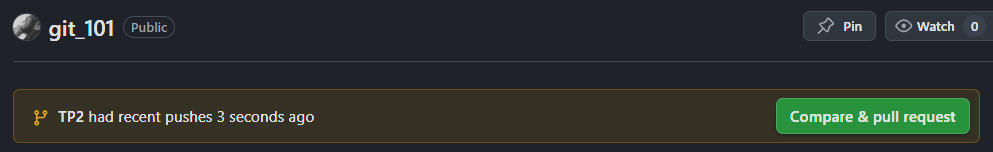
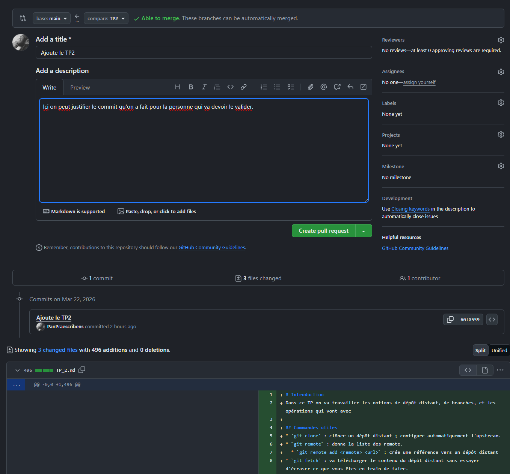
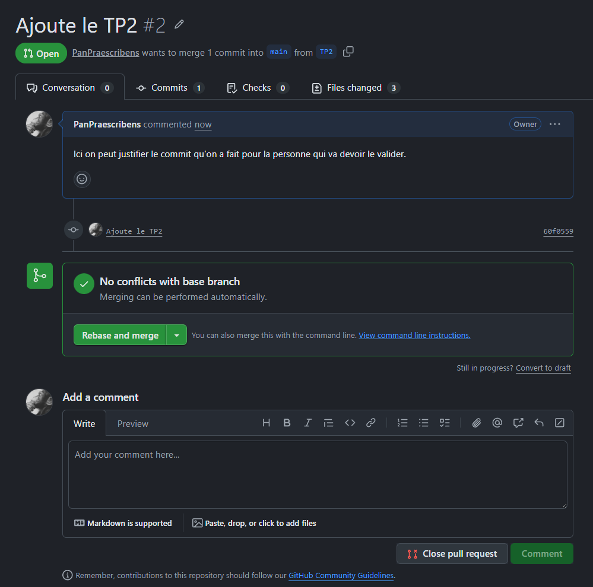
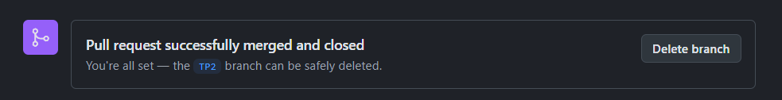

# Branches
Dans les paragraphes précédents, on a utilisé plusieurs copies d'un même dépôt dans différents répertoires, pour les besoins de notre TP.  
Cela devrait vous faire vous poser la question : qu'est-ce qui nous empêche d'utiliser une copie de notre dépôt pour faire des essais ?  
En fait, rien du tout, du moment que vous travaillez localement !

Dans notre exemple du travail nomade, on aurait pu utiliser le dépôt `mon_pc_bureau` pour faire une version du travail, et faire des commits.  
En parallèle on aurait tout à fait pu faire des commits différents sur `mon_laptop`. Si on fait un petit graphe on aurait une situation comme celle là :  
```
mon_depot_distant/master : A <- B 
mon_pc_bureau/master     : A <- B <- C
mon_laptop/master        : A <- B <- D
```

Le problème avec tout cela, c'est que sémantiquement ça ne marche pas.  
La branche `master` est censée représenter *une* réalité, pas trois.  
En créant le commit C sur `mon_pc_bureau`, on fait avancer la branche `master`, ce qui est acceptable, mais quand on crée le commit D sur le dépôt `mon_laptop`, on a une divergence. Ça marche localement, mais par rapport à `mon_pc_bureau` on a un ***conflit***.  

Quand on travaille seul, il est assez rare de se retrouver dans une telle situation, par contre quand on est plusieurs sur un même projet, c'est très courant. Et il faut donc adapter ses méthodes de travail.  

Ces méthodes, on peut commencer à les utiliser même en solo, pour se familiariser aux commandes et aux concepts, sans les difficultés qui vont inévitablement apparaitre à plusieurs.  

## Nouveau développement, nouvelle branche
La première habitude à prendre c'est de comprendre que la branche principale est une zone intouchable, en quelque sorte.  
On ne veut jamais *directement* la modifier, mais seulement l'utiliser pour contenir du code parfait.   
Tout nouveau développement se fait donc dans une branche, qui pourra être ensuite intégrée dans la branche principale *après validation*.  
L'idée c'est qu'*à tout moment*, on peut prendre une copie de la branche principale, et elle contient du code compilable, stable, qui fonctionne.  
Le code contenu dans une branche n'a pas cette contrainte. En fait, on peut même avoir plusieurs niveaux de branches, chacun avec des contraintes plus ou moins fortes de stabilité, de propreté du code, de validation, etc.  

Mettons-nous dans un des dépôts que nous avons créés, mis à jour, dans lequel nous allons créer de nouveaux commits.  

```
cd ~/mon_pc_bureau
git pull
git branch dev
git switch dev
```

Ici on vient de créer la branche appelée `dev` puis on bascule dedans.  
La branche créée est une copie conforme de la branche principale, à ce stade.  
```
mon_depot_distant/master : A <- B 
mon_pc_bureau/master     : A <- B
mon_pc_bureau/dev        : A <- B
```
Créons un commit :
```
echo "Le travail de developpement en cours va dans la branche dev" >> main.txt
git commit -a -m "dev: rajoute une ligne"
```
À ce stade on peut créer autant de commits qu'on veut.  

## Basculer de branche
Si on utilise la commande `git switch master` juste après notre commit, on bascule instantanément sur la branche principale, et si on examine le contenu du fichier `main.txt` on peut voir que notre texte nouvellement ajouté n'existe pas.
On peut revenir sur notre branche avec `git switch dev` et à nouveau si on examine le contenu de `main.txt`, le fichier est bien modifié.  

### Basculer avec des fichiers modifiés
Maintenant modifions notre fichier `main.txt` dans notre branche de dev, et essayons de basculer sur master à nouveau :  
```
echo "Travail en cours" >> main.txt
git switch master
```
Normalement, git va vous opposer une fin de non recevoir :  
```
error: Your local changes to the following files would be overwritten by checkout:
        main.txt
Please commit your changes or stash them before you switch branches.
Aborting
```

En effet, le fichier main.txt, modifié, n'existe pas dans git. Il nous prévient donc aimablement que pour basculer, il a besoin de prendre la version `master` de `main.txt`, mais que votre version en cours serait irrémédiablement perdue !  
Il vous propose deux solutions : 
* faire un commit de vos changements
* mettre vos changements dans une réserve (*stash* en anglais)

Vous connaissez déjà la première solution. Mais avant d'essayer la deuxième, voyons une autre subtilité de la bascule entre branche.

Nous sommes toujours dans la branche, donc effaçons nos changements sur `main.txt` avec `git restore main.txt` qui va par défaut remettre le fichier dans son état au dernier commit sur la branche en cours.  

### Basculer avec des fichiers non-suivis
Maintenant créons un nouveau fichier sur notre branche :  
```
echo "Un nouveau fichier créé pendant notre développement" > dev.txt
git switch master
```
Vous pouvez voir que le fichier existe sur master après la bascule.
```
echo "Modifié dans master" >> dev.txt
git switch dev
```
Et si nous modifions ce fichier, vous pouvez voir que nous pouvons tout à fait basculer, et que sa modification est bien conservée.  

En effet, `dev.txt` n'est pas connu de git, et donc il n'y touche pas. Du moment qu'il peut exister sur les branches où vous basculer, git va simplement tout modifier *autour de lui*, sans y toucher.  
> Si un fichier non-suivi est créé dans un répertoire qui n'existe pas dans l'autre branche, vous aurez un problème.  

Git bascule de branche en changeant ce qu'il connait. Il peut créer ou effacer des fichiers qui existe ou pas dans la branche active.  
Mais il ignore les fichiers non-suivis (ou ignorés) et les laisse en l'état si possible.  

### Utilisation de la réserve pour basculer proprement
Ajoutons le fichier `dev.txt` dans un commit. Nous pourrons le voir apparaitre et disparaitre quand nous basculons de branche.  
```
git add dev.txt
git commit -m "Crée le fichier dev.txt"
```
Puis remodifions notre fichier `main.txt` pour montrer l'utilisation de la réserve : 
```
echo "Travail en cours" >> main.txt
git switch master
```
Vous avez toujours l'erreur, mais cette fois-ci avant de basculer on va mettre nos modifications de côté :  
```
git stash 

 > Saved working directory and index state WIP on dev: 861b384 Crée le fichier dev
```
Le message vous indique que toutes les modifications en cours ont été mises de côté dans une réserve nommée `WIP` par défaut.  
Vous pouvez immédiatement constater que les modifications ont bien disparues.  
Et vous êtes également capable de basculer de branche, puisque votre branche `dev` est désormais "propre" après l'utilisation de `stash`.  

Vous pouvez (depuis n'importe quelle branche) voir la liste des réserves existantes :
```
git stash list

> stash@{0}: WIP on dev: 861b384 Crée le fichier dev
```

Revenez sur la branch `dev` et vous pouvez reprendre votre travail où vous en étiez :  
```
git switch dev
git stash pop

> On branch dev
Changes not staged for commit:
  (use "git add <file>..." to update what will be committed)
  (use "git restore <file>..." to discard changes in working directory)
        modified:   main.txt

no changes added to commit (use "git add" and/or "git commit -a")
Dropped refs/stash@{0} (bc2b6ba9749db18421fa19cc3a75a0181eff0d26)
```
La sous commande `pop`, exécutée sur la branche d'origine de la réserve, va effacer la réserve pour la ré-appliquer sur la branche.  


## Pousser votre branche sur le dépôt distant
Tout comme la branche principale, on veut conserver son travail sur une branche fille, et donc on va utiliser le même principe que précédemment et pousser nos modifications sur le dépôt distant.  
Normalement, une branche créée localement n'a pas d'upstream par défaut, donc vous allez l'initialiser au premier `push`.
```
git commit -a -m "Fini le dev"
git push -u origin dev
```
La commande push devrait vous renvoyer les détails de ce qu'elle envoie et au final, vous pourrez constate avec `git log --oneline` que tout est à jour entre local et distant :  
```
86c56a3 (HEAD -> dev, origin/dev) Fini le dev
861b384 Crée le fichier dev
274a3e0 Ajoute une nouvelle ligne
fda6f8e (origin/master, master) Modifie main
222e06b Crée le fichier main
```

## Requête de fusion
Ici, dans le processus habituel dans un environnement professionel, on passe à l'étape appelée *Pull Request*, ou *Merge Request*, selon les environnements.  
Dans les deux cas on parle de la même chose : demander aux autorités gérant la branche principale si elles veulent bien accepter votre branche et la fusionner avec la principale.  
Les logiciels de CI/CD comme GitLab ou pour vous GitHub proposent des interfaces modernes pour gérer cette partie, qui est hors du cadre de git à proprement parler.  

### Méthode Github
Si vous êtes sur Github, vous allez pouvoir vous rendre dans votre dépôt sur le site web et effectuer tout le processus de fusion de la branche sur la branche principale directement depuis l'interface web.  

Normalement Github va automatiquement détecter l'existance d'une nouvelle branche et le *push* de commits va automatiquement lancer un dialogue de création de PR/MR à votre prochaine connexion.  
  

Cliquez la notification pour ouvrir le dialogue de création de requête :  


Dans le processus réel, c'est un collègue qui va ensuite traiter votre demande et la valider (ou pas).  


Validez simplement la requête, ce qui aura pour effet de fusionner les commits de la branche sur la branche principale.  


Github vous propose d'effacer la branche distante, qui vient d'être fusionnée.

Une fois l'opération validée, `origin/dev` est fusionnée avec `origin/master`, et vous n'avez plus qu'à mettre à jour votre branche `master` locale via `git pull` sur votre branche `master` et effacer votre branche `dev` qui n'est plus nécessaire :  

```
git switch master
git pull
git branch -d dev
```

### Méthode Git
Git ne propose pas de système pour gérer les PR/MR de la même manière. Et on ne peut pas faire de fusion de branche directement dans un dépôt nu, donc on va faire la méthode git :  
* On fusionne la branche sur notre branche master, localement.
* On envoie pousse les changements vers le dépôt distant.
* On peut effacer notre branche devenu inutile.

```
git switch master
git merge dev
> 
  Updating fda6f8e..86c56a3
  Fast-forward
  dev.txt  | 1 +
  main.txt | 2 ++
  2 files changed, 3 insertions(+)
  create mode 100644 dev.txt
```
Ici on a la mention "fast forward" qui nous indique que l'opération est executée immédiatement car dev est une fille directe de master, sans aucun conflit possible. C'est une situation idéale.  

On envoie la fusion au dépôt distant : 
```
git push
>
  Total 0 (delta 0), reused 0 (delta 0), pack-reused 0 (from 0)
  To /home/philippe/mon_depot_distant/
    fda6f8e..86c56a3  master -> master
```

Nous sommes donc maintenant au même niveau local et distant.  
On peut faire le ménage et effacer la branche.  
```
git branch -d dev
> 
  Deleted branch dev (was 86c56a3).
```
Notez qu'ici, on a pas effacé la branche à distance, elle existe toujours.  
Dans le cas de Github, c'est une option à cocher dans la PR/MR.  
Dans le cas de git pur, on peut faire 
```
git branch --remote -d origin/dev
>
  Deleted remote-tracking branch origin/dev (was 86c56a3).
```

Dans les deux cas, on peut tout à fait garder la branche et continuer le développement, si on est tout seul à travailler dessus.

## Fusion de branches

### Fast-forward : fusion avec ... rien
La situation de nos branches ici est idéale puisque la branche `dev` est une descendante directe de la branche `master`, et aucun commit n'a été poussé sur `master` pendant que vous travailliez sur `dev`.  
On a donc pas de divergence à proprement parler, entre les deux branches.

D'un point de vue pratique, git n'a absolument rien à créer pour effectuer la fusion. Il déplace juste des pointeurs.  

Si on présente les branches dans leur entièreté avant fusion, on peut mieux voir :  
```
A <- B <- master
A <- B <- C <- D <- E <- dev
```
> Fondamentalement, tout ce que git retient d'une branche, c'est où se trouve son dernier commit.  
> La chronologie de la branche est reconstruite au moment où on interroge git, en remontant de parent en parent.
> `master` c'est juste une pointeur sur `B`, qui lui-même pointe sur `A`.  
> Ainsi la branche `master` c'est `A <- B` 

Lorsqu'on fusionne `dev` sur `master`, git va remonter les branches jusqu'à un commit en commun, ici `B`.  
Puis il va essayer de rejouer la suite des commits, ici `C <- D <- E`.
Comme `C` est descendant de `B` il n'y a aucun problème, aucun conflit.  
Tout ce que git a à faire, c'est de faire pointer `master` sur `E`.  
Vu autrement :

```
A <- B <- master             ____\
      \                      ____ >     A <- B <- C <- D <- E <- dev
       `C <- D <- E <- dev       /                           \-- master
```

Concrètement, on a changé la valeur contenue dans `.git/refs/heads/master` de `B` à `E`.

Et de la même manière, quand on parle d'"effacer" une branche, on retire simplement une étiquette : on efface `.git/refs/heads/dev` qui contenait le hashcode `E`. C'est tout ! Les commits `A` et `B` existent toujours, bien sûr.

### Fusion de deux branches
La situation dans laquelle on se trouve plus fréquemment, c'est qu'on a des changements dans les deux branches qu'on veut fusionner.  

La chose importante à comprendre ici, c'est que git ne va pas faire d'analyse *sémantique* pour savoir si il peut fusionner, par exemple, deux versions d'un même fichier.  
Il ne va pas analyser les lignes pour savoir ce qu'elles veulent dire. L'algorithme de fusion va juste regarder s'il peut facilement ajouter / retirer des lignes, des fichiers, des répertoires, ou bien si on a des lignes (fichiers, répertoires) qui vont se chevaucher de manière conflictuelle.

Lorsqu'on a des modifications sur un même fichier, git va *généralement* déclarer un conflit et interrompre le processus de fusion pour vous donner une occasion de résoudre le conflit.

```
git branch add-stuff
git switch add-stuff

echo "WORK WITH DATA" >> dev.txt
mkdir new_folder
cd new_folder
echo "Nouveau fichier" > data.txt

git add *
git commit -m "Feat : nouveaux trucs"

git switch master
cd ..
echo "Hotfix" >> main.txt
git commit -a -m "Hotfix"

git merge add-stuff

>
  Merge made by the 'ort' strategy.
    dev.txt             | 2 ++
    new_folder/data.txt | 1 +
    2 files changed, 3 insertions(+)
    create mode 100644 new_folder/data.txt
```

Comme on a modifié / ajouté des choses dans la branche, mais que dans le commit de `master` on a seulement modifié `main.txt`, les deux branches sont considérées comme pouvant être fusionnées sans problème.  

### Fusion avec conflit
```
git switch add-stuff

cd new_folder
echo "Données de developpement" >> data.txt

git add *
git commit -m "Ajoute des données de dev"

git switch master

echo "Données de production" >> data.txt
git commit -a -m "Ajoute des données de prod"

git merge add-stuff

>
  Auto-merging new_folder/data.txt
  CONFLICT (content): Merge conflict in new_folder/data.txt
  Automatic merge failed; fix conflicts and then commit the result.

~/mon_pc_bureau/new_folder (master|MERGING) $
```

Ici on a modifié le même fichier et donc git interrompt le processus de fusion pour nous laisser corriger le problème. On remarquera tout de suite le prompt qui a changé pour nous indiquer qu'on est au milieu d'une fusion : `master|MERGING`.

Première chose à savoir : on peut abandonner la fusion en utilisant
```
git merge --abort
```
qui nous ramène simplement au dernier commit.  
Mais ici on va résoudre le conflit, c'est à dire décider quelle version du fichier nous voulons garder dans la branche qui accepte la fusion (ici `master`).

Git utilise toujours le même format pour résoudre des conflits : 
```
Un fichier bien utile
<<<<<< HEAD
Données de prod
=======
Des données de dev
>>>>>> add-stuff
```
Chaque zone en conflit dans le fichier est délimitée par une première ligne indiquant la branche qui reçoit, souvent nommée "nous" : `<<<<<<< HEAD`  
Ensuite on a le texte existant dans cette branche qui reçoit. Ici les données de prod.  
Une ligne intermédiaire sépare les contenu des deux branches : `=======`  
Puis on a le contenu arrivant de la branche à fusionner, ici les données de developpement.  
Enfin, une ligne finale ferme le bloc, avec le nom de la branche à fusionner, souvent nommée "eux" : `>>>>>>> add-stuff`  

Les outils un peu avancés vont proposer tout un tas de mécanismes pour automatiser le processus. Cliquer sur un bouton pour accepter "leurs changements", sur un autre pour garder "nos changements", etc.  

Au final, tout cela peut se faire directement dans une éditeur, en réécrivant le fichier comme on souhaite qu'il apparaisse dans sa version finale.  
Ici, nous sommes dans la branche principale, donc on va garder les données de production.  

Éditez le fichier de manière à ce qu'il ne reste que :  
```
Un fichier bien utile
Données de prod
```

> Rien ne vous force à choisir l'une ou l'autre version. Vous pourriez absolument réécrire le fichier entier et garder cette nouvelle version, si vous le vouliez.

Puis ajoutez le fichier à l'index (`git add data.txt`) pour indiquer à git que la résolution de conflit est faite.  

S'il y avait plusieurs fichiers avec des conflits, il faudrait tous les ajouter avant de pouvoir continuer.  

Pour finir la procédure de résolution, on fait donc un commit, avec un message de fusion appropriée, pour par exemple expliquer pourquoi on a choisit une verion plutôt qu'une autre.  

`git log --oneline --graph` va nous montrer clairement que le commit nouvellement créé a deux parents :  
```
*   16e6a6d (HEAD -> master) Fusion : données de prod
|\
| * e09523b (add-stuff) Ajoute des données
* | d7ceb90 Ajout des données de prod
| |
```

## Mettre à jour sa branche
Ici on vient de voir un exemple où on avait commencé du travail sur une branche, puis pour une raison ou une autre, on avait dû effectuer du travail sur la branche principale, causant une divergence.  

Une pratique courante est de récupérer ces modifications, souvent non-conflictuelles, sur notre branche.  

On peut tout à fait faire cela avec une fusion, mais il existe une méthode très utilisée dans les méthodes modernes et qui a l'avantage de laisser un graphe plus lisible : ***rebase***.  

On va "simplement" reconstruire notre branche, mais à partir des dernières nouveautés. Comme si tout le travail effectué sur la branche avait été effectué depuis le dernier commit sur la branche de référence (ici `master`).  

Créons une situation divergente, mais non-conflictuelle : on modifie le fichier `data.txt` dans notre branche, et on modifie le fichier `dev.txt` dans la branche `master`. Revenez dans le répertoire racine du projet et effectuez les opérations suivantes :  

```
git switch add-stuff
cd new_folder
echo "Encore des données" >> data.txt
git commit -a -m "Ajoute des données de dev"

git switch master
cd ..
echo "VALIDATE DATA" >> dev.txt
git commit -a -m "Hotfix : valide les données"

git log --oneline --graph --all

* e5847ea (HEAD -> master) Hotfix : valide les données
| * 9813e02 (add-stuff) Modification sur les données
|/
*   16e6a6d Fusion : données de prod
```

On a bien une divergence. Notre objectif ici est d'intégrer les derniers changements de la branche `master` donc on va sur la branche pour travailler.  
Mais au lieu de fusionner, on va utiliser une autre commande :  

```
git switch add-stuff
git rebase master
> 
  Successfully rebased and updated refs/heads/add-stuff.
git log --oneline --graph --all

* eda903a (HEAD -> add-stuff) Modification sur les données
* e5847ea (master) Hotfix : valide les données
* 16e6a6d Fusion : données de prod
```

Ici on était dans une situation facile où il n'y avait pas de conflit. `git merge` aurait également fonctionné sans souci : 

```
git reset --hard ORIG_HEAD
git merge master
>
  Merge made by the 'ort' strategy.
  dev.txt | 1 +
  1 file changed, 1 insertion(+)

git log --oneline --graph --all

*   d5e4b96 (HEAD -> add-stuff) Merge branch 'master' into add-stuff
|\
| * e5847ea (master) Hotfix : valide les données
* | 9813e02 Modification sur les données
|/
*   16e6a6d Fusion : données de prod
```

> La commande `git reset --heard ORIG_HEAD` vous permet de revenir au commit précédent le denier `merge`, ou le dernier `rebase`. 

Peu importe la méthode que vous utilisez, mais dans les deux cas votre branche absorbe les modifications venues de la branche source.  
Dans les deux cas, s'il y a des conflits, vous devez les résoudre avant de finir l'opération.  
La différence est surtout esthétique au niveau du graphe : si vous effectuez plusieurs mises à jour de votre branche, le rebase est "invisible", alors que les multiples fusions vont créer des commit additionels qui n'apportent pas forcément d'informations (sauf si vous devez résoudre un conflit).  

> Le choix entre fusionner et faire un rebase va souvent être une question de méthodologie d'équipe, et le rebase domine très largement.  
