# Qu'est-ce qu'un SVC ?
File version control system. Un système de contrôle de versions de fichiers.

## Versions de fichiers ? 
Quand on travaille sur le long cours, des fois on veut sauvegarder ce qu'on a fait, pas directement sur le fichier en cours mais dans une version de secours, au cas où. Mon_travail_202603111438.txt, au cas où Mon_travail.txt se retrouve corrompu par le logiciel pourri que j'utilise pour faire mon travail, par exemple. Et à chaque fois que je fais une telle sauvegarde, on peut parler d'une nouvelle version du fichier. 

## sauvegarder son travail, partager son travail
Les logiciels de contrôle de version permettent non seulement la sauvegarde et la gestion de l'historique, mais également le travail à distance et le partage avec d'autres personnes grâce à une architecture client / serveur.  
Historiquement, les logiciels tels que SVN, Visual SourceSafe, RTC Jazz, etc nécessitent l'installation d'un serveur dédié et de logiciels clients lourds pour gérer tout cela.

# Historique git

## pourquoi git ? 
Les gestionnaires de code source existent depuis bien longtemps, et à l'époque de l'écriture de Linux, Linus Torvald avait déjà pas mal de choix, et il avait pris BitKeeper. Mais le choix d'un logiciel propriétaire pour ce qui devait être un système Open Source était controverse, et les menaces des propriétaires de rendre l'utilisation du logiciel payant poussèrent Linus à écrire son propre système...

## différence : décentralisé
Git est généralement décrit comme un système de gestion de version décentralisé. Cet épithète a une grande importance et signifie tout simplement que git se suffit à lui-même. Contrairement à SVN, il n'y a pas besoin de d'abord configurer un serveur pour stocker le code. Git marche immédiatement, localement, et peut ensuite être connecté à un serveur pour gérer des copies distantes du dépôt de code. Mais rien n'empêche un développeur de travailler hors-ligne et de ne se connecter que ponctuellement à un serveur pour envoyer ses commits ou récupérer des mises à jour.

## différence : pas de delta
Une autre différence absolument fondamentale est que git ne travaille pas avec des différences. Souvent, les logiciels de gestion de version, pour minimiser l'occupation de la mémoire, vont enregistrer seulement les différences d'une version à la suivante : ajout de x lignes, changement de texte, suppression d'un autre morceau, etc.
Git choisit une approche radicalement différente : si un fichier n'a pas changé, on stocke une simple référence, par contre s'il change, on sauvegarde une nouvelle copie complète (compressée).

# Configuration git
Petit survol de la configuration de git sur une machine.
Comme dit précédemment, git se suffit à lui même. Du moment que le logiciel est installé sur une machine, on peut travailler avec localement, et à distance si on se connecte à une autre machine qui a git (et les flux ouverts entre les deux).
On peut commencer à utiliser git tel quel, et pour faire des commit il faut au moins s'identifier, ce que git vous demandera si les options n'existent pas.

## Machine / Utilisateur / Projet
Git possède trois niveaux de configuration, du plus large au plus précis. Si une option est déclarée à plusieurs niveaux, c'est le niveau le plus "bas" qui prend le pas (local > global > system)

## Quelques options

### name, email, editor
Vous avez besoin de configurer `user.name` et `user.email` si vous voulez faire des commit, sinon git vous demandera leur valeur à votre premier commit.
`core.editor` vous permet de configurer l'éditeur de texte qui va être ouvert par défaut lorsque git en a besoin, par exemple si vous faites un commit sans message dans la commande.

### autres
Il existe de nombreuses options qui sont bien utiles, mais dont il est compliqué de comprendre l'intérêt si on ne connait pas la problématique.  
Par exemple un certains nombres d'options aident à gérer les différences entre OS.
* `core.autocrlf` sert à gérer les retours à la ligne, qui sont encodés de manière différente sur linux et Windows.
* `core.ignorecase` gère le fait que sous Windows, les noms de fichiers ne sont pas sensibles à la casse alors que sous Linux si.
* `core.hideDotFiles` traite des fichiers/répertoires qui sont considérés comme invisibles sous Linux, mais pas sous Windows.
etc
On peut également condfigurer des aliases de commandes utilisées souvent via des options de configuration

# Dépôt git
On parle en français de "dépôt" git, mais clarifions immédiatement de quoi on parle pour éviter les erreurs de compréhension.
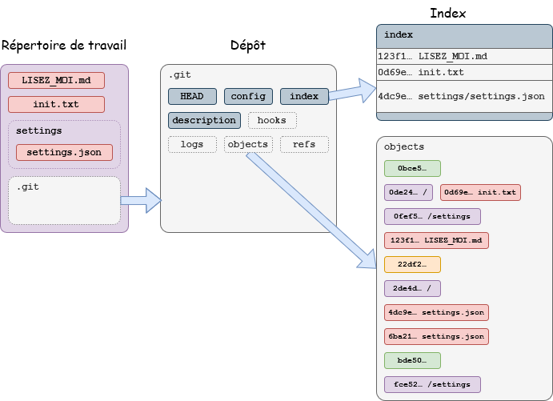

## Les trois zones
En pratique, on appelle "dépôt git" l'ensemble des fichiers et répertoires contenus dans un répertoire où se trouve également un répertoire .git  
En réalité c'est un abus de langage, et on va donc préciser les choses immédiatement.  

### L'espace de travail : votre code en cours
C'est le répertoire dans lequel vous travaillez sur votre code.  
*Une version du code*.  
Car grâce à certaines commandes, on peut basculer d'une version à l'autre, sans changer de répertoire. Git s'occupe automatiquement de changer ce qui doit l'être (si on le lui demande).

Le répertoire racine de votre espace de travail contient un répertoire `.git` et c'est la présence de ce sous-répertoire qui définit votre espace de travail comme étant géré par git.  

On va souvent utiliser le terme de "dépôt" pour désigner l'espace de travail, mais c'est un abus de langage et pour ce cours, nous devons prendre garde de bien distinguer le dépôt (.git) et le code.  

### Le dépôt : la base de données qui contient TOOoo.….ooOOUT
Le dépôt à proprement parler, c'est le répertoire `.git`  

Certains dépôts, appelés dépôts nus (*bare repository*) ne contiennent pas de code lisible / éditable et ne contiennent en fait que le contenu du répertoire `.git`.  
Typiquement ce serait votre dépôt distant, sur lequel personne ne travaille directement, mais avec lequel on intéragit régulièrement via les commandes appropriées de mise à jour.  

Ce répertoire contient ***TOUT***.  

Si vous l'ouvrez vous pouvez voir un certain nombre de fichiers et sous-répertoires :  
```
.
|-- HEAD         # un pointeur qui indique exactement à quoi correspond la zone de travail en cours (quel commit, quelle branche)
|-- config       # un fichier qui contient la configuration locale, pour le dépôt en cours
|-- description  # une description du dépôt, de son contenu. Utile pour les dépôts nus.
|-- hooks/       # des répertoires représentant des évènements avant/après actions, dans lesquels vous pouvez mettre des scripts à exécuter
|-- index        # l'index à proprement parler
|-- logs/        # tous les historiques de toutes les branches, ainsi qu'un historique de *vos actions*.
|-- objects/     # tous les objets gérés par git : les répertoires, les versions de vos fichiers, les commits, les tags.
`-- refs/        # des pointeurs (vers les têtes des branches, vers les dépôts distants, vers des commits spécifiques pour les tags)
```

### L'index : une zone intermédiaire, qui contient les choses qu'on veut mettre dans le prochain commit
L'index est généralement présenté de manière conceptuelle : une zone dans laquelle on place les changements qu'on vient de faire pour ensuite les enregistrer dans un commit.  
En réalité, l'index est un vrai fichier d'index. C'est à dire qu'il contient une liste complète de tous les fichiers contenus dans le répertoire de travail, avec entre autre un hash qui représente la version "actuelle".  
La commande `git add` sert simplement à mettre à jour l'index, et git sait ensuite déterminer, en regardant le dernier commit, si un fichier de l'index est un ajout, une modification, une suppression, etc.  

En anglais on utilise le terme de "stage" pour cette zone conceptuelle : littéralement "scène", qu'on peut comprendre comme le "pas de lancement" pour une fusée, ou une "zone de préparation" pour un colis à envoyer, etc.  
Ce terme permet de bien distinguer avec l'index lui-même qui contient tous les fichiers, mêmes ceux qui ne sont pas modifiés, et donc ne seront pas inclus dans le prochain commit.

Lorsque git prépare un commit, il parcourt l'index, et compare avec le dernier commit pour savoir ce qui va devoir être inclus. Il peut également parcourir le répertoire de travail pour vous informer des fichiers absents de l'index, ou qui auraient changés depuis que vous les avez placés dans l'index.  

Mais fondamentalement, et comme nous l'avons vu en TP, au moment où vous lancez la commande `git add`, une copie de votre fichier est placée dans le dépôt, *même si vous décidez finalement de ne pas l'inclure dans un commit !*  
Car oui, git considère les objets du dépôt comme son bien le plus précieux et ne les efface jamais, sauf instruction explicite de votre part.  

## Les objets du dépôt
Et justement, je veux revenir un peu plus en détail sur le contenu du dépôt, en particulier sur ce que git stocke, et sous quelle forme.

### Hachage cryptographique
Git utilise une fonction de hachage cryptographique pour généré un code unique à partir de données fournies.  
Une explication détaillée dépasse le cadre de ce cours, mais à la base il s'agissait de SHA-1 qui a ensuite été remplacé par une version plus moderne.
Chaque version de chaque fichier stocké dans le dépôt est représentée par un code hexadécimal unique à quarante caractères. De même, git stocke des hashes pour les répertoires, les tags et enfin les commits.  
Git utilise ces codes pour trier les objets et les ranger dans le répertoire `.git/objects`. Les deux premiers caractères représentent un premier niveau de sous-répertoires, qui contiennent ensuite les objets eux-mêmes. Par exemple l'objet `dd5470fca04ebea19a5af9f4d6b02949d69d7ce8` est donc rangé dans `.git/objects/dd/5470fca04ebea19a5af9f4d6b02949d69d7ce8`.
Pour savoir ce qu'un de ces objets contient, vous pouvez utiliser la commande `git show` en lui donnant un code de hash (pas besoin du code complet du moment que la partie que vous donné est unique). La commande vous renvoie le type d'objet, son hash et son contenu.

### Les types d'objets
#### Les blobs
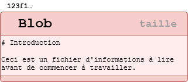  
Un *blob* est un terme technique venant de l'anglais "**B**inary **l**arge **ob**jects" et c'est simplement une autre façon de parler de fichier. Le terme est souvent utilisé en base de données.  
En pratique, git n'est pas vraiment fait pour gérer des objets *vraiment* larges, et il a été conçu pour travailler surtout avec des fichiers *textes*, donc l'utilisation du terme est très ironique...  

Mais les objets blobs sont donc toutes les versions gérées par git des fichiers du dépôt de code. Le blob lui-même est une version compressée du fichier original (avec l'algorithme ZLib).  

Un effet intéressant de l'utilisation d'une fonction de hachage pour identifier les fichiers de manière unique : si vous modifier un fichier de telle manière qu'il revient à un état qu'il avait déjà eu dans le passé, git va simplement utiliser une référence à la version déjà existante.
[schéma avec +Toto -Toto d'un côté en diff. Et le hash qui change A -> B -> A]

#### Les trees
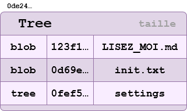  
Un arbre c'est juste un autre nom pour parler d'un répertoire. Mais contrairement à un simple répetoire, un *tree* contient des références à des *blobs*, donc à une version bien précise d'un fichier donné. Un arbre peut contenir un autre arbre, bien sûr.  
Si vous utilisez la commande `git show` sur un code d'arbre, il vous listera les noms de fichiers et répertoires contenus, mais si vous utilisez la commande `git ls-tree` avec ce même code, vous aurez une liste précise des hashcodes de ces fichiers.  
Donc pour être bien clair, un *tree*, comme un *blob*, c'est une ***version*** d'un répertoire.  
> Attention, git ne crée un tree que s'il contient quelque chose. Git ne gère pas les répertoires vides.

#### Les commits
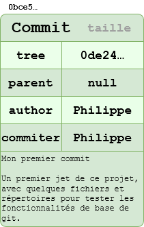  
Un commit est une capture de l'état d'une base de code à un instant donné. C'est un point de sauvegarde de votre travail.
L'objet stocké dans le dépôt contient :  
* *tree* : une référence à un arbre, qui est donc l'état du répertoire racine au moment du commit, et par extension contient donc les versions des fichiers au moment du commit.  
* *parent* : une référence à un (ou plusieurs) commit(s) dont celui-ci est descendant. Le commit initial n'a pas de parent.
* *author* : l'auteur du commit, tel que renseigné dans user.name et user.email; un timestamp indique le moment où l'auteur a créé le commit.
* *commiter* : la personne qui intègre le commit dans le dépôt, si elle est différente de l'auteur. Cette entrée contient aussi un timestamp.
* *comment* : un commentaire qui va permettre de savoir à quoi correspond ce commit lorsqu'on consulte un historique des différent commits du dépôt.  

#### Les tags
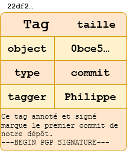  
Dans le principe, un tag est un raccourci qui va mapper un label lisible sur un hashcode de commit.  
Par exemple, au lieu d'utiliser le hash `0bce5f13bf953820fd5578c728a629e5ecdc50b8` pour faire référence au commit qui contient la version 1.0 de votre logiciel, on peut créer un tag `v1.0` qui pourra alors être utilisé dans toute commande attendant un hashcode.  
Les tags sont des fichiers stockés dans .git/refs/tags, qui contiennent simplement un hashcode.  
Il existe deux types de tags, cependant : 
* Tags légers : le hashcode dans le fichier tag est celui d'un commit. Par ex `.git/refs/tags/v1.0` qui contient seulement `0bce5f13bf953820fd5578c728a629e5ecdc50b8`
* Tags annotés : le hashcode présent dans le fichier tag pointe vers un objet contenant :  
  * object : le hash de l'objet ciblé par le tag
  * type : le type de l'objet ciblé, normalement "commit"
  * tag : le nom du tag
  * tagger : l'auteur du tag, avec un timestamp de la date de création du tag
  * comment : un message détaillant la raison d'être du tag, éventuellement avec une signature PGP

Typiquement les légers sont pour une utilisation locale, et les annotés sont pour être partagés et donc utilisés par tous les collaborateurs sur un dépôt.  
Les tags sont des objets indépendants et doivent donc être poussés explicitement si on veut les partager avec un dépôt distant, avec `git push --tags`. On peut pousser seulement les tags annotés avec `git push --follow-tags`.

#### Tous ensemble
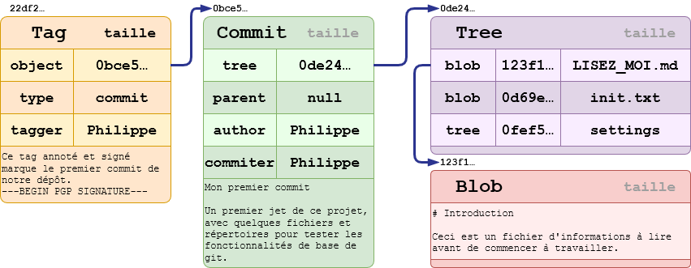  
Ce schéma illustre le commit initial d'un dépôt.  
On voit un tag annoté qui pointe sur ce commit, puis on voit le commit qui pointe vers un arbre, qui lui-même contient des références à deux blobs (deux fichiers présents dans le répertoire racine du dépôt), et un tree (qui doit contenir au moins un blob).  

---

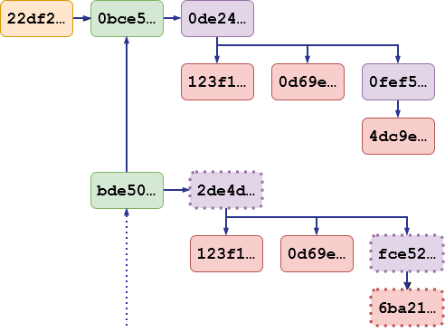  
Ce deuxième schéma illustre la même situation, mais sans les détails, et on peut également voir un deuxième commit qui pointe vers l'initial.  
C'est le début d'un historique.  

On voit pour ce deuxième commit que le fichier contenu dans le sous-répertoire `settings` a été modifié (hash différent), ce qui modifie le tree le contenant et ainsi de suite. Par contre les fichiers `LISEZ_MOI.md` et `init.txt` n'ont pas changé, donc le commit fait toujours référence au même hash.  
Le commit à venir fera référence à ce commit actuel, et ainsi de suite.  

# Développement local solo
Nous allons commencer par le scénario le plus simple : utiliser git localement sur sa machine.  
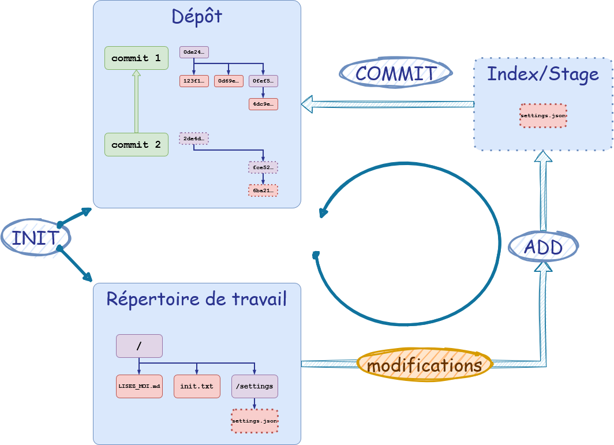

## Initialisation / Mise à jour
La première étape consiste en la création d'un dépôt.  

La commande `git init` va créer dans le répertoire en cours, notre répertoire de travail, un sous-répertoire `.git`, notre dépôt à proprement parler. C'est l'existence de ce sous-répertoire qui indique à git que ce répertoire est important pour nous et que nous aimerions qu'il s'y intéresse.

> ⚠️ Mais attention, Git n'est pas un service qui tourne en arrière-plan et qui vous surveille. C'est à vous de lui dire ce que vous voulez au travers des nombreuses commandes qu'il propose.

## Modifications
En travaillant, nous allons modifier le contenu du répertoire de travail; créer des fichiers et des sous-répertoires, les modifier, en effacer, etc.

La commande `git status` vous permet d'avoir une vue synthétique, vous indiquant entre autre les changements que vous avez effectués.

## Ajout à l'index
La première étape pour sauvegarder le travail accompli.  

On décide des changements qu'on veut sauvegarder en les plaçant dans l'index avec la commande `git add`.  

La commande va créer un hash pour la version du fichier présente dans le répertoire de travail. Si le hash n'existe pas déjà dans `.git/objects` un nouvel objet est créé.  
Dans tous les cas, le hash est stocké dans l'index `.git/index`.  

> Attention, c'est l'objet ajouté avec `git add` qui va être placé dans le commit, pas le fichier présent dans le répertoire de travail !  
Donc si vous modifiez encore un fichier après `git add` mais avant `git commit`, ces changements ne seront pas pris en compte dans le commit !

## Création d'un commit
La commande `git commit` est en fait très rapide puisque l'essentiel du travail (génération des hash et stockage des objets) a été fait lors de l'exécution de `git add`.  
Le commit lui-même n'a besoin que de faire référence à l'objet tree racine, qui permet indirectement de recontruire tout le répertoire de travail dans l'état désiré.

## Le cycle continue - évolution de l'historique
Une fois l'état de notre travail sauvegardé dans un commit, on peut continuer à le modifier en revenant à la première étape.  
À chaque fois qu'on le souhaite, on va ajouter les changements puis créer un commit.  
La fréquence des commits est à l'appréciation de chacun.  
On veut parfois faire des commits seulement lorsqu'on a du code stable, propre, mais cela peut s'avérer difficile lorsqu'on est en train de développer quelque chose qui prend plus de temps que prévu.

## Quel intérêt ?
Le cycle de vie que nous venons de voir ne concerne que du développement purement local : une développeuse solitaire sur sa machine.  
Qu'apporte git à ce stade ?  
Si la machine est détruite, si le répertoire `.git` est perdu, on perd tout !  

Mais git nous apporte déjà une chose précieuse : un historique des modifications effectuées.  
Un exemple classique de l'utilité de l'historique, c'est la possibilité de comprendre quand une regression a été introduite.  
On peut imaginer un bug qu'on découvre, et en le diagnostiquant on réalise la ligne de code qui le provoque. En aller chercher l'historique de git, par recoupement, on peut voir quels commits ont manipulés le fichier concerné, voire la ligne coupable.  
Ou bien à l'inverse on peut juste savoir que le programme marchait encore à telle date, et en regardant l'historique, voir quels changements ont été effectués qui pourraient avoir causé le problème.  

Cette possibilité de consulter l'historique est absolument vitale et immédiatement disponible avec git; pas besoin de serveur spécial, pas besoin de connexion internet.  
`git log` (et ses nombreuses options) nous permet de consulter l'historique directement en ligne de commande.

# Développement solo avec un dépôt distant
Comme on l'a dit précédemment, utiliser git en local est déjà bénéfique, mais ne respecte pas le principe 3-2-1 de la sauvegarde des données : au moins 3 copies de notre code, sur au moins 2 types de support (disque dur, cloud, clé USB, etc), dont **au moins un distant**.  
Heureusement git est livré avec toutes les fonctionalités vous permettant de gérer votre dépôt localement, mais également à distance.  

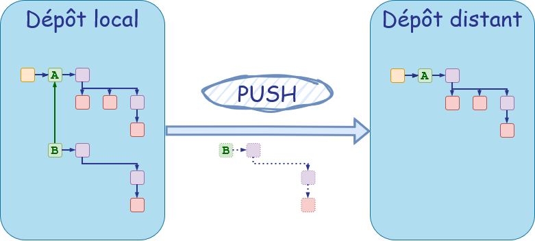

## Configurer le dépôt distant
Si vous avez créé votre dépôt d'abord localement via `git init`, il n'est pas lié à un dépôt distant, par défaut.  
La commande `git remote` va vous permettre d'ajouter un lien vers un dépôt distant.  
Puis la commande `git push` vous permettra ensuite d'envoyer des mises à jour vers ce dépôt configuré.  
Par exemple, si j'ai un dépôt prêt à recevoir des données sur Github, je pourrais lancer les commandes suivantes :
```bash
git remote add origin https://www.github.com/mon_compte/mon_depot.git
git push --set-upstream origin master
```
La première commande indique qu'on veut créer un dépôt distant qu'on nomme "origin" (le nom par défaut) et qui se trouve à l'URL fournie.

> Notez qu'ici on utilise le protocole HTTPS pour communiquer (git peut utiliser un certain nombre d'autres méthodes) et qu'on ne verra pas ici les éventuels identifiants à fournir pour que la connexion se fasse. Partons du principe que ce dépôt est libre d'accès.

La deuxième commande, utilisée au premier `push`, fait le lien entre le dépôt local, et le dépôt distant "origin" et précise le nom de la branche distante associée à la branche en cours (ici, on est sur la branche "master" par défaut).

## Utilisation 
Dès lors, on peut faire appel à `git push` sans autre option, et git enverra les différences *entre le dépôt local et le dépôt distant*.  
Par exemple dans le schéma plus haut, on voit que seuls les objets du commit B, qui n'existent pas encore sur le dépôt distant, seront transférés.  

Comme pour les commits, il n'y a rien d'automatique avec git, et c'est à chacun d'envoyer ses mises à jour quand il le souhaite.  Cela pourrait être à chaque commit, ou bien en fin de journée avant de se déconnecter, ou la prochaine fois que l'internet sera disponible.  
Chacun doit évaluer ce qu'il est prêt à perdre si les modifications ne sont sauvegardées à distance.  

# Développement solo nomade
Maintenant qu'on a un dépôt distant, on peut faire évoluer sa méthode de travail en réalisant qu'on est plus vraiment limité à travailler sur un seul ordinateur.  

## Clôner son dépôt
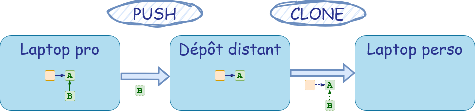
À partir du moment où on a un dépôt distant, on peut alors travailler sur n'importe quelle autre machine y ayant accès, et disposant de git.  
Ici on a travaillé pendant la journée sur l'ordinateur portable du travail (ou de l'IUT), et après avoir bien téléversé les derniers changements en date dans le dépôt distant, on va pouvoir tout télécharger sur un ordinateur perso pour continuer à travailler en soirée, le weekend, ou quand on est en déplacement.  

La première étape sur la nouvelle machine, au lieu de faire `git init`, va être de faire une copie conforme de notre dépôt avec la commande `git clone`.  
Par exemple, pour créer une copie du dépôt précédent dans le répertoire `mon_dépôt` :
```bash
git clone https://www.github.com/mon_compte/mon_depot.git mon_dépôt
```

Git va créer un sous-répertoire `mon_dépôt` dans le répertoire où est lancé la commande, qui va alors contenir le dépôt `.git` entier, téléchargé depuis votre source, et va également contenir votre espace de travail tel qu'il a été sauvegardé dans le dernier commit.  

Le dépôt va également être automatiquement configuré pour faire des push, c'est à dire que si vous tapez la commande `git remote get-url origin` vous devriez avoir la valeur `https://www.github.com/mon_compte/mon_depot.git` et si vous faites un `git log` pour voir l'historique du dépôt que vous venez de télécharger, vous devriez voir, au niveau du dernier commit, quelque chose comme : 
```
commit e2c1002ed8af1b3c0b5c534c4ed53798c6b61658 (HEAD -> master, origin/master, origin/HEAD)
```
au lieu du simple `(HEAD -> master)` qu'on avait en développement solitaire.  

## Travailler sur le clône
À partir du moment où vous avez clôné votre dépôt, vous pouvez continuer à utiliser git comme précédemment, en utilisant le cycle de vie pour du développement en solo, avec dépôt distant.  
Là encore, à vous de gérer vos mises à jour. Tant que vous ne faites pas un push, votre dépôt distant n'est pas au courant de votre travail, et donc il n'existe que sur votre ordinateur portable personnel, et encore moins sur l'ordinateur portable de votre travail.  

## Synchroniser des dépôts multiples
Encore une fois, git ne fait rien tout seul. C'est à vous d'avoir de la discipline et de bien mettre à jour votre dépôt distant, qui est voué à être votre "source de vérité".  
Tant que votre dépôt distant est à jour, vous pouvez potentiellement continuer votre travail sur n'importe quelle autre machine, puis pousser des modifications vers le dépôt distant et continuer plus tard sur une autre machine.  
D'ailleurs rien ne vous empêche de tout effacer sur une machine locale, qui ne vous appartient pas, après avoir fait votre travail et l'avoir téléversé.
Du moment que vous avez envoyé vos modifications en ligne, tout va bien.  

----
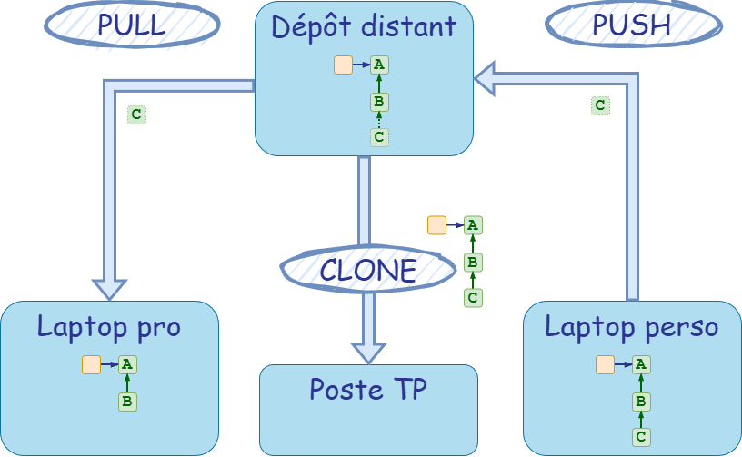  
Dans ce schéma on fini le travail sur le laptop perso avec `git push`, qui met donc à jour le dépôt distant.  
Si on veut continuer son travail sur le laptop pro, il faut d'abord faire une mise à jour avec `git pull`.  
On pourrait également travailler sur une machine différente, par exemple un poste informatique en salle de TP, auquel cas il faudrait d'abord télécharger le dépôt entier avec `git clone`.  

Le cycle peut ensuite continuer : 
* Pull ou Clone avant de travailler sur un poste
* Travail
* Push lorsqu'on a fini de travailler sur ce poste

# Explorer des réalités alternatives : les branches
À partir du moment où on parle de sites multiples, on peut se poser la question de travailler à plusieurs, mais il devrait également être clair que nous n'avons pas assez d'outils à notre disposition pour gérer cela.  
Si je travaille sur mon poste laptop perso mais que mon collègue travaille sur son laptop pro, en partant du même code, que va-t-il se passer lorsque nous poussons nos dernières modifications au même moment ?  

Avant de pouvoir répondre à cette question, nous allons découvrir un concept fondamental de la gestion de versions : les branches.  

Nous avons vu que git, avec le concept des commits, nous permet de créer des points de sauvegarde tout au long de notre processus de développement. Parfois le commit représente un état stable de notre projet, une version qui fonctionne. Puis nous continuons le cycle.  
Parfois, continuer nécessite de résoudre un dilemme : nous voulons implémenter une fonctionalité mais nous ne sommes pas sûr. On pourrait essayer cette façon, ou bien une autre. Comment savoir ?  

## Point de divergence
Par exemple, vous voulez implémenter une fonctionalité, et deux librairies différentes sont possibles : Alpha et Beta. Et bien vous allez créer ce qu'on appelle une branche, ou plusieurs, et tester une solution dans chaque.  
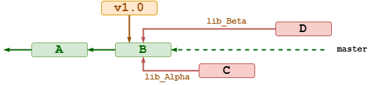  
Ici on voit notre branche principale "master", dont le dernier commit est B.  
Nous l'avons taggué "v1.0" pour indiquer que ce commit représente une version importante, stable, de notre travail.  
Nous allons créer une branche avec `git branch` puis basculer dessus avec `git switch` :
```
git branch lib_Alpha
git switch lib_Alpha
```

Une fois sur la branch lib_Alpha, nous pouvons travailler et lorsque nous avons fait nos modifications et que nous décidons de créer un commit, c'est le même principe que d'habitude.

Si nous faisons un `git log` à ce stade, nous aurons quelque chose comme :
```
9053d2e (HEAD -> lib_Alpha) Commit C qui utilise la librairie Alpha dans une branche séparée
1802920 (tag:v1.0, master) Commit B : version finale 1.0 qui fonctionne
c30aa59 Commit A : modifications sur la branche principale
```

Lorsque nous avons fait notre commit C, nous pouvons basculer de nouveau sur la branche principale.  
```
git switch master
```
La commande va modifier notre espace de travail pour revenir là où nous en étions au commit B.
Tout notre travail effectué depuis ce commit a "disparu" et nous pouvons donc recommencer sur cette base pour tester la deuxième librairie.  
La commande `checkout` nous permet de créer une branche et basculer sur celle-ci en une seule commande : 
```
git checkout -b lib_Beta
```
Nous sommes sur la branche lib_Beta et tout ce que nous écrivons dès lors n'affecte pas la branche principale, ni bien sûr la branche lib_Alpha.   
Au bout d'un moment nous allons créer un commit D et notre log nous montrera alors quelque chose comme :  
```
ef52ae1 (HEAD -> lib_Beta) Commit D qui implémente la librairie Beta
1802920 (tag: v1.0, master) Commit B : version finale 1.0 qui fonctionne
c30aa59 Commit A : modifications sur la branche principale
```

Remarquez comme à chaque fois, on voit bien les commit A et B, qui sont des ancêtres.  
Lorsqu'on fait des schémas on va souvent montrer les branches comme divergentes, mais du point de vue de la branche, son historique remonter jusqu'au tout premier commit :  
* La branche lib_Alpha contient A, B et C
* La branche lib_Beta contient A, B et D 
* La branche main contient A et B

## Convergence
Si les branches nous permettent d'explorer le champ des possibles, de tester des idées, et de travailler en parallèle avec des collègues, chacun sur sa branche, on ne peut cependant pas continuer à créer des branches à l'infini.  
On pourrait tout à fait imaginer qu'on développer une version complètement dédiée à la libraire Alpha et une autre pour la libraire Beta, mais dans ce cas, pour des questions de facilité, de maintenabilité, il vaut mieux carrément créer de nouveaux dépôts, de nouveaux projets (par exemple une version Linux et une version Windows d'un même logiciel).  
Mais dans la majorité des cas, on va simplement faire un choix et intégrer les changements faits dans telle ou telle branche dans la branche principale, pendant que les autres branches seront tout simplement abandonnées, voire effacées.  
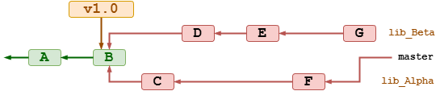  
Pour déclarer qu'on veut récupérer tout l'historique d'une branche sur une autre, pour les fusionners donc, on utilise la commande `merge` sur la branche réceptacle.  
```
git switch master
git merge lib_Alpha
```

Ici on est dans une situation idéale, car on n'a rien fait sur la branche master depuis le commit B. La branche à fusionner est donc une descendante naturelle et la fusion s'effectue sans autre forme de procès.  
Les branches master et lib_Alpha sont maintenant identiques.  

Si on compare les trois branches on a :  
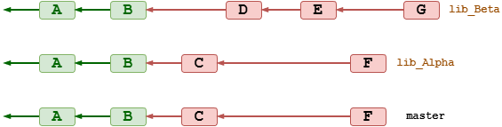

Un git log dans `master` nous montrera quelque chose comme :  
```
fc23400 (HEAD -> master, lib_Beta) Commit F : fonctionalité implémentée
ef52ae1 Commit D qui implémente la librairie Beta
1802920 (tag: v1.0) Commit B : version finale 1.0 qui fonctionne
c30aa59 Commit A : modifications sur la branche principale
```

Si on basculait dans la branche `lib_Beta` on verrait :  
```
fc23400 (HEAD -> lib_Beta, master) Commit F : fonctionalité implémentée
ef52ae1 Commit D qui implémente la librairie Beta
1802920 (tag: v1.0) Commit B : version finale 1.0 qui fonctionne
c30aa59 Commit A : modifications sur la branche principale
```

La seule différence serait `HEAD`, notre tête de lecture, qui indique simplement où nous sommes quand nous tapons la commande.