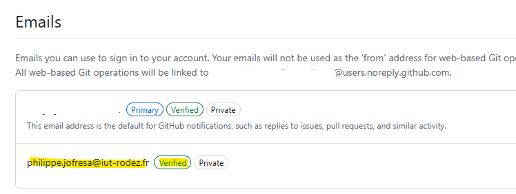
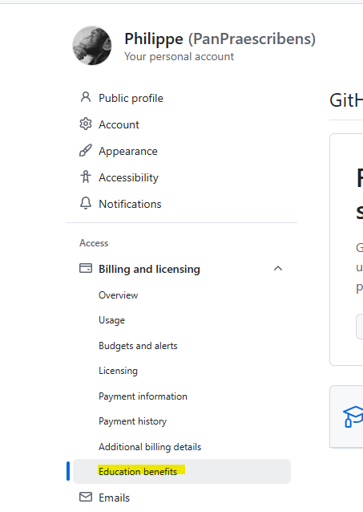
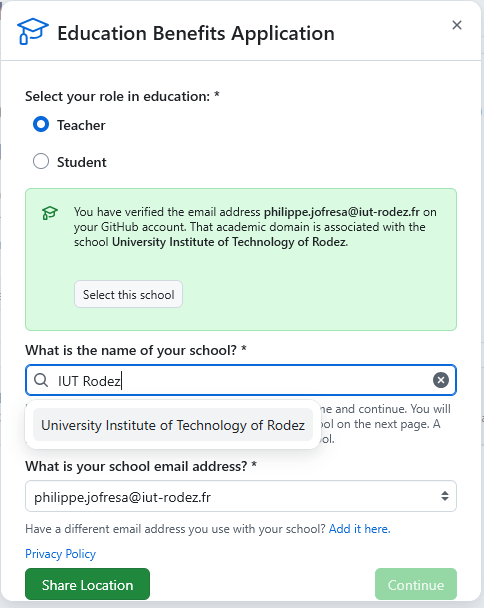
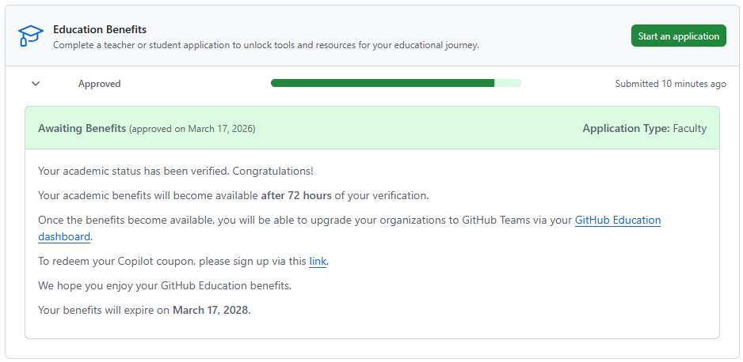

# Convertir un compte Github en mode Education
Ce document devrait vous aider à basculer votre compte Github en compte Github Etudiant.

# Créer un compte github
Si vous n'en avez pas un, créez un compte sur Github en utilisant votre email de l'IUT
## Compte existant
Si vous avez déjà un compte, comme moi, vous pouvez aller dans votre profil, dans la partie *Settings* puis dans la section **Emails**.  
Ajoutez votre email de l'IUT dans la liste.  
Après l'avoir vérifié (allez lire vos emails et cliquez le lien), vous aurez désormais votre email perso et votre email de l'IUT dans la liste, comme ceci :  

# Postulez pour un compte Education
Rendez-vous maintenant dans la section *Billing & Licensing* puis le sous menu *Education Benefits*.  
  

Remplissez simplement le formulaire en indiquant votre établissement, votre email, etc.  
  

Le processus va également vérifier que vous êtes physiquement à l'IUT, vous demandez une preuve que c'est bien vous, etc. Pour ma part j'ai utilisé la webcam et ai scanné ma carte de l'IUT, avec mon visage également visible.  
Vous pouvez également scanner le document et envoyer le fichier, si vous préférez.  

# Attendre la validation
A priori une fois que vous avez envoyé tout cela, il faut simplement attendre validation et c'est tout.  
C'est plutôt rapide, la mienne est arrivée au bout de quelques minutes alors que j'étais a priori un cas un peu bizarre (le système a détecté que je n'étais pas sur le campus)
  

En attendant ques les bénéfices Education soient actifs, vous pouvez déjà utiliser votre compte github comme un dépôt distant pour vos exercices git !  

